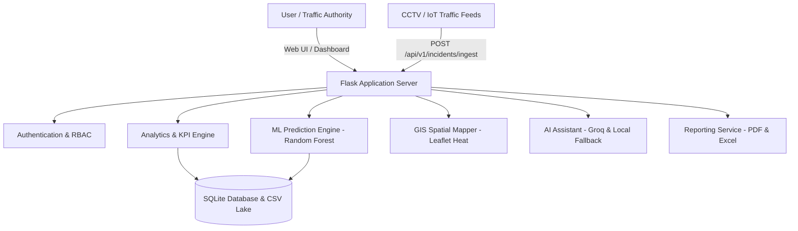

# 🚦 TrafficVision AI — Intelligent Traffic Safety & Analytics Platform

[](https://python.org)
[](https://palletsprojects.com/p/flask/)
[](https://scikit-learn.org/)
[]()

**TrafficVision AI** is an enterprise-grade AI-powered traffic safety intelligence platform designed for urban planners, municipal traffic authorities, and highway administrators. It combines Machine Learning predictive modeling, interactive GIS spatial heatmaps, dual AI assistant capabilities, and multi-format reporting (PDF & Excel) to proactively identify blackspots and mitigate collision hazards.

---

## 🌟 Key Features

### 🧠 1. Machine Learning Accident Risk Simulator (`/risk-predictor`)
- **What-If Scenario Modeling**: Interactively simulate risk factors including Corridor, Weather, Vehicle Classification, Traffic Density, and Time of Day.
- **Dynamic Risk Gauge (0–100%)**: Instant probability scoring with severity classification (`Fatal`, `High Risk`, `Moderate`, `Low Risk`).
- **Explainability & Factor Weights**: Real-time breakdown of environmental and temporal hazard contributors.
- **AI Actionable Safety Mitigation**: Dynamic operational directives (e.g., speed reductions, police patrol deployment, high-lux illumination towers).

### 🗺️ 2. GIS Collision Spatial Hotspots & Heatmap (`/hotspots`)
- **Interactive Multi-Layer GIS Map**: Powered by Leaflet & Leaflet-Heat plugins.
- **Dynamic Layer Toggling**: Seamlessly switch between Pin Marker Clusters and continuous Density Heatmaps.
- **Multi-Factor Filtering**: Filter incidents by Severity (`Critical`, `High`, `Warning`) and Metropolitan District.
- **Corridor Centering**: 1-click fly-to navigation for flagged accident corridors.

### 📊 3. Executive Dashboard & Telemetry Stream (`/dashboard`, `/telemetry`)
- **Live KPI Grid**: Real-time tracking of Total Incidents, Fatal Collisions, High-Risk Corridors, and System Safety Scores.
- **Chart.js Visualizations**: Monthly incident progressions, vehicle distribution, road crash frequency, and weather correlation.
- **Corridor Smart Safety Index**: Composite safety scoring algorithm ranking the most hazardous blackspots.

### 🤖 4. Dual AI Assistant (`/ai-assistant`)
- **Cloud LLM Powered**: Real-time conversational assistant powered by Groq API.
- **Dataset Context Injection**: Summarizes active dataset telemetry directly into model prompts.
- **Local Telemetry Fallback**: Built-in rules engine providing instant answers even without external API connectivity.

### 📑 5. Multi-Format Reporting Suite (`/reports`)
- **Executive PDF Export**: Color-coded, printable safety report generated using ReportLab.
- **Multi-Tab Styled Excel Workbook**: High-fidelity `.xlsx` export formatted with OpenPyXL containing KPI Summaries, Hazard Rankings, and Raw Telemetry Logs.

### 🌐 6. RESTful Integration API (`/api/v1/...`)
- `GET /api/v1/health` — System status and active dataset diagnostics.
- `GET /api/v1/kpis` — Real-time KPI metrics payload.
- `GET /api/v1/hotspots` — Geospatial coordinates and risk rankings for blackspots.
- `GET /api/v1/corridors` — Ranked hazardous corridors with composite safety scores.
- `POST /api/v1/predict` — Asynchronous ML inference endpoint for external applications.
- `POST /api/v1/incidents/ingest` — IoT sensor / Traffic feed live telemetry ingestion.

---

## 🏛️ System Architecture



---

## 🚀 Quick Start Guide

### 1. Prerequisites
- Python 3.10 or higher
- Git

### 2. Installation

```bash
# Clone repository
git clone https://github.com/your-org/ai-traffic-analysis-platform.git
cd ai-traffic-analysis-platform

# Create virtual environment
python -m venv .venv
source .venv/bin/activate   # On Windows: .venv\Scripts\activate

# Install dependencies
pip install -r requirements.txt
```

### 3. Initialize Database & Train Models

```bash
# Initialize SQLite database
python init_db.py

# Train Random Forest & Gradient Boosting ML models
python ml_models/train_models.py
```

### 4. Run Application

```bash
python app.py
```
Open your browser at `http://127.0.0.1:5000`

---

## 🛡️ Default User Credentials

| Role | Username | Password |
|---|---|---|
| **Administrator** | `admin` | `admin123` |
| **Traffic Analyst** | `analyst` | `analyst123` |

---

## 🧪 Verification & API Examples

### Predict Incident Risk via cURL:
```bash
curl -X POST http://127.0.0.1:5000/api/v1/predict \
     -H "Content-Type: application/json" \
     -d '{"road": "NH-48", "city": "Delhi", "vehicle": "Heavy Truck", "weather": "Rain", "density": "High", "hour": 23}'
```

---

## 📄 License
Distributed under the MIT License. See `LICENSE` for more information.
